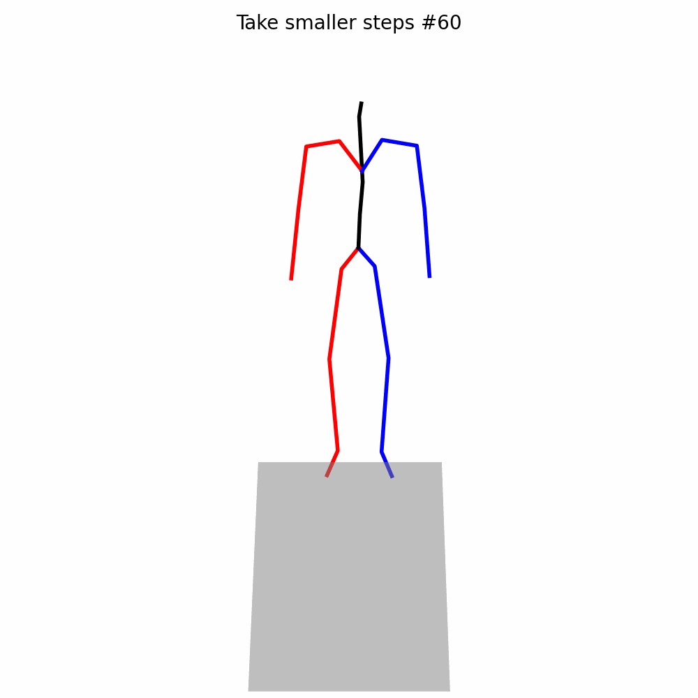

# HUMAN-TCI: Hierarchical Multi-Stream Motion-Aware Network with Torso-Centered Interaction for Text-to-Motion Retrieval

## Overview
HUMAN-TCI is a text-to-motion retrieval framework that learns a joint embedding space between natural language descriptions and human motion sequences. The model integrates:

- **Text Encoders**: BERT-LSTM and CLIP (for rich semantic understanding)
- **Motion Encoder**: Hierarchical Multi-Stream GRU (capturing body-part level dynamics)
- **Interaction Mechanism**: Torso-Centered Interaction (TCI) for improved spatial-temporal alignment

The system retrieves the most relevant motion sequence given a text query (and vice versa).

---

## Features
- Multi-modal embedding learning for text and motion
- Support for both BERT-LSTM and CLIP text encoders
- Hierarchical multi-stream modeling of human body parts
- Visualization tools for retrieved motions
- End-to-end pipeline: training, inference, and visualization

---

## Project Structure
```
├── train.py                # Training script
├── inference.py            # Retrieval / evaluation script
├── render.py               # Visualization script
├── models/                 # Model architectures (text + motion encoders)
├── utils/                  # Helper functions (metrics, preprocessing, etc.)
├── data/                   # Dataset directory
├── checkpoints/            # Saved model weights
├── outputs/                # Retrieved results and videos
└── README.md
```

---

## Installation

### Requirements
- Python 3.8+
- PyTorch (tested on 1.12.0+cu102)
- CUDA (optional, for GPU acceleration)

### Install dependencies
```bash
pip install -r requirements.txt
```

---

## Dataset Preparation

Prepare the dataset (e.g., KIT-ML or HumanML3D) in the following format: Download from authors work

```
data/
├── motions/
├── texts/
└── splits/
```

Ensure motion features and text annotations are properly aligned.

---

## Training

To train the model:

```bash
python train.py --config configs/train.yaml
```

Key options:
- `text_model`: bert-lstm / clip
- `motion_model`: multi-stream-gru
- `batch_size`, `learning_rate`, etc.

---

## Inference / Evaluation

To evaluate retrieval performance:

```bash
python inference.py --checkpoint checkpoints/model.pth --split test
```

Metrics reported:
- R@1, R@5, R@10
- Median Rank (MedR)
- Mean Rank (MeanR)
- NDCG - Spacy, Spice

---

## Visualization

To visualize retrieved motions:

```bash
python render.py --input outputs/ --save_dir videos/    - Only humanml3d Viualization 
```

This will generate motion videos for qualitative evaluation.

---
Qualitative Results
Text-to-Motion Retrieval Examples

Below are sample retrieval results generated by HUMAN-TCI:

Text Query	Retrieved Motion
A person walks forward and waves	

## 🎥 Results




A person kicks and steps back	

A person jumps and turns	

## 🎥 Qualitative Results

### Example: "A person walks forward and waves"

<p align="center">
  
</p>
Note: Replace the GIF file names with your actual results stored in the videos/ directory.

## Outputs

The system produces:
- Retrieval rankings
- Quantitative evaluation metrics
- Visualization videos of motion sequences

---

## Supplementary Material

The repository includes:
- Full training and inference code
- Pretrained model checkpoints (if provided)
- Visualization scripts
- Output videos demonstrating retrieval performance

---

## Citation

If you find this work useful, please cite:

```
@article{human_tci,
  title={HUMAN-TCI: Hierarchical Multi-Stream Motion-Aware Network with Torso-Centered Interaction for Text-to-Motion Retrieval},
  author={Anonymous Author(s) },
  year={2026}
}
```

---


## Acknowledgements

This work builds upon prior research in text-to-motion retrieval, multimodal learning, and human motion modeling.

Our implementation is largely based on the following works, and we sincerely thank the authors for making their codebases publicly available:

MDM: Human Motion Diffusion Model
https://github.com/GuyTevet/motion-diffusion-model

TMR: Text-to-Motion Retrieval Using Contrastive 3D Human Motion Synthesis
https://mathis.petrovich.fr/tmr/

Text-to-Motion Retrieval: Towards Joint Understanding of Human Motion Data and Natural Language.
https://github.com/mesnico/text-to-motion-retrieval

Their contributions have been instrumental in advancing research in this domain and have significantly supported the development of this project.

